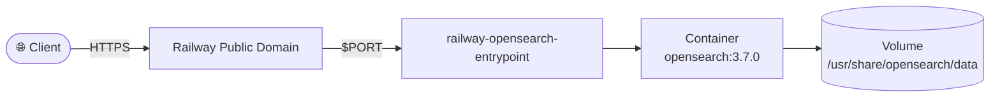

# OpenSearch


OpenSearch is an open-source, distributed search and analytics engine forked from Elasticsearch, widely used for full-text search, log analytics, and observability dashboards. This Railway template deploys a single-node OpenSearch instance pre-configured with the security plugin enabled, a tuned JVM heap size for smaller Railway plans, and persistent storage support via a mounted volume.

[](https://railway.com/deploy/bNPyEG?referralCode=2_sIT9&utm_medium=integration&utm_source=template&utm_campaign=generic)

## 🏗️ Architecture



## Environment variables

```bash
OPENSEARCH_INITIAL_ADMIN_PASSWORD=replace-with-strong-password
```

`OPENSEARCH_INITIAL_ADMIN_PASSWORD` is required — set it as a generated secret in the Railway dashboard. OpenSearch 2.12+ refuses to start without it.

## Persistent storage

Attach a Railway volume and mount to:

- `/usr/share/opensearch/data`

The template enforces this with `requiredMountPath` in `railway.toml`.

## Notes

- The security plugin is enabled by default (no `DISABLE_SECURITY_PLUGIN` override); admin auth is required to access the cluster.
- For production, use a strong `OPENSEARCH_INITIAL_ADMIN_PASSWORD` and configure TLS as needed beyond the defaults.
- JVM heap is tuned to `512m` by default for smaller plans.

<!-- footer -->
---

[](https://github.com/vergissberlin/railwayapp-airbyte) [](https://github.com/vergissberlin/railwayapp-airflow) [](https://github.com/vergissberlin/railwayapp-cloudbeaver-ce) [](https://github.com/vergissberlin/railwayapp-codimd) [](https://github.com/vergissberlin/railwayapp-django) [](https://github.com/vergissberlin/railwayapp-email) [](https://github.com/vergissberlin/railwayapp-fastapi) [](https://github.com/vergissberlin/railwayapp-flask) [](https://github.com/vergissberlin/railwayapp-flowise) [](https://github.com/vergissberlin/railwayapp-gitlab) [](https://github.com/vergissberlin/railwayapp-grafana) [](https://github.com/vergissberlin/railwayapp-homeassistant) [](https://github.com/vergissberlin/railwayapp-influxdb) [](https://github.com/vergissberlin/railwayapp-mjml) [](https://github.com/vergissberlin/railwayapp-mongodb) [](https://github.com/vergissberlin/railwayapp-mqtt) [](https://github.com/vergissberlin/railwayapp-mysql) [](https://github.com/vergissberlin/railwayapp-n8n) [](https://github.com/vergissberlin/railwayapp-nodejs) [](https://github.com/vergissberlin/railwayapp-nodered) [](https://github.com/vergissberlin/railwayapp-opensearch) [](https://github.com/vergissberlin/railwayapp-openwebui) [](https://github.com/vergissberlin/railwayapp-outerbase-studio) [](https://github.com/vergissberlin/railwayapp-postgresql) [](https://github.com/vergissberlin/railwayapp-redis) [](https://github.com/vergissberlin/railwayapp-typo3)
